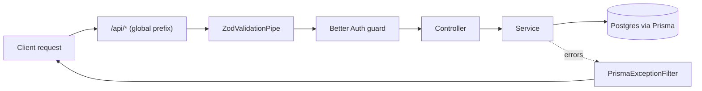
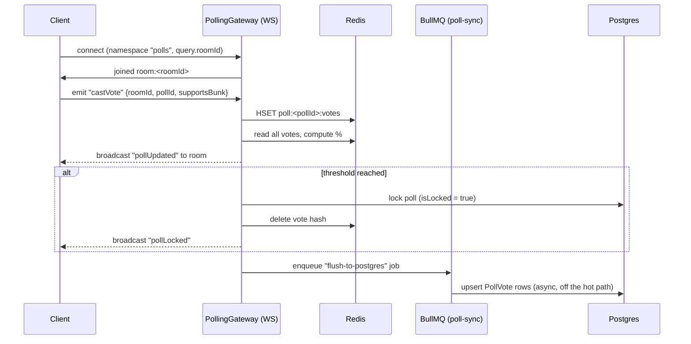

# Architecture Overview

## Tech Stack

- **NestJS 11** on the Express platform — modular, controller/service/module structure.
- **PostgreSQL** as the primary datastore, accessed through **Prisma** using the `@prisma/adapter-pg` driver adapter (a raw `pg` `Pool`, not Prisma's default query engine binary).
- **Redis** used for three distinct purposes: BullMQ job queues, the Socket.IO horizontal-scaling adapter, and as a fast write-through cache for live poll votes.
- **BullMQ** for background job processing (currently: flushing poll votes to Postgres).
- **Socket.IO** for real-time features (currently: live bunk-poll voting).
- **Better Auth** (`better-auth` + `@thallesp/nestjs-better-auth`) for authentication, with the `@better-auth/expo` plugin for mobile (React Native/Expo) session support.
- **Zod** for schema validation, applied globally through `nestjs-zod`'s `ZodValidationPipe`.
- **Brevo** (via plain `fetch` calls, no SDK) for transactional email (email verification).

## Folder Structure

```
src/
├── main.ts                    # App bootstrap — global pipes/filters, prefix, WS adapter
├── app.module.ts               # Root module — wires up every feature module
├── app.controller.ts           # Root "/" and "/health" endpoints (public)
├── app.service.ts
│
├── auth/                       # Better Auth configuration & wiring
├── user/                       # Authenticated user's own profile
├── room/                       # Rooms, membership, invite codes
├── timetable/                  # Per-room class schedules
├── attendance/                 # Per-user attendance records
├── poll/                       # Bunk polls — HTTP create + WebSocket voting + Redis + BullMQ
├── email/                      # Brevo email sending (global module)
├── redis/                      # Shared Redis client + Socket.IO Redis adapter
├── database/                   # Shared Prisma client (global module)
└── common/
    ├── config/env.config.ts    # Zod schema for all required env vars, validated at boot
    ├── generated/prisma/       # Prisma Client output (generated, not hand-written)
    ├── filters/                # PrismaExceptionFilter — maps DB errors to HTTP responses
    └── ws-auth.guard.ts         # Cookie-based session auth guard for WebSocket connections
```

Each feature module (`room`, `timetable`, `attendance`, `poll`, `user`) follows the same shape:

```
feature/
├── feature.module.ts
├── feature.controller.ts   # HTTP routes
├── feature.service.ts      # Business logic + Prisma calls
└── dto/
    └── *.dto.ts             # Zod schema + generated DTO class per request shape
```

## How a Request Flows

1. **`main.ts`** bootstraps the app with `bodyParser: false` — this is **required** by Better Auth, which parses the raw request body itself. Don't re-enable Nest's default body parser.
2. A **global prefix of `/api`** is applied to every route **except** `/` and `/health` — those two stay unprefixed so they're easy to hit from load balancers/uptime checks.
3. A **global `ZodValidationPipe`** validates every incoming request body/params against the Zod schema attached to its DTO. Validation failures short-circuit with a 400 before the controller method ever runs.
4. Better Auth's guard (wired in via `@thallesp/nestjs-better-auth`) protects routes by default — a route is only public if it's explicitly marked `@AllowAnonymous()` (see `AppController`). Every other controller in this codebase relies on `@Session()` to pull the authenticated user, meaning the routes are implicitly protected.
5. The controller delegates to its module's **service**, which talks to Postgres via the shared **`DATABASE_CONNECTION`** Prisma client (injected from the global `DatabaseModule`).
6. A **global `PrismaExceptionFilter`** catches Prisma errors (e.g. constraint violations, not-found lookups) and turns them into proper HTTP error responses, so individual services don't need to hand-catch every Prisma exception.



## Real-Time & Background Processing (Bunk Polls)

The poll feature is the most architecturally involved part of the codebase, because it mixes HTTP, WebSockets, Redis, and a background queue to stay fast under concurrent voting:



Why it's built this way:
- **Redis is the source of truth during an active poll.** Every vote does a fast in-memory `HSET`/`HGETALL` instead of a Postgres round-trip, so the UI can update in real time even with many concurrent voters.
- **Postgres is only written to asynchronously**, via a BullMQ job (`PollSyncConsumer`), keeping the WebSocket handler fast and non-blocking.
- **The Socket.IO Redis adapter** (`RedisIoAdapter`, wired in `main.ts`) means poll broadcasts work correctly even if the app is scaled to multiple instances — an event emitted on one instance still reaches sockets connected to another.
- **WebSocket auth** is handled separately from HTTP auth: `WsAuthGuard` manually reads the `better-auth.session_token` cookie off the socket handshake and looks up the session in Postgres, since Better Auth's Nest guard is HTTP-only.

See [CONCEPTS.md](./CONCEPTS.md) for the domain-level explanation of what a poll *is*, and [API.md](./API.md) for the exact WebSocket event contracts.
