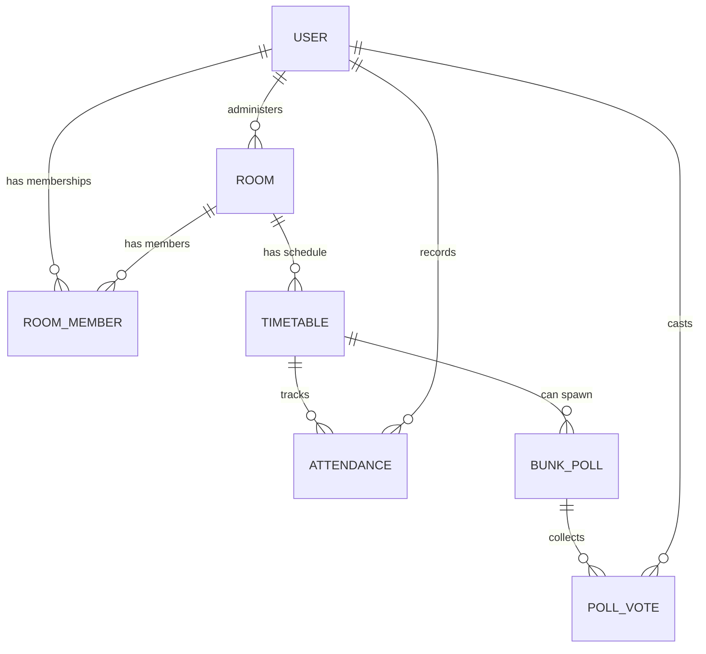

# Core Concepts

This document explains *what* the domain objects mean and *why* certain things are built the way they are. Read this if the API reference alone leaves you wondering "okay, but why?"

## The Domain Model



### Room
A **Room** represents a class group (e.g., "CS-301 Morning Batch"). It has exactly one admin (`adminId`) and a randomly generated `inviteCode` (6 random bytes, base64url-encoded) that others use to join. Anyone with the code can request to join, but see **RoomMember** below — joining isn't the same as being approved.

### RoomMember
Tracks a user's membership in a room, with two important fields:
- `role` — e.g. `ADMIN` (the creator, auto-approved) vs. a regular member.
- `isApproved` — new joiners start **unapproved**. The room admin must explicitly approve them (`PATCH /api/rooms/:roomId/members/:memberId/approve`) before they count toward poll eligibility. This prevents strangers with a leaked invite code from immediately swaying a vote.

### Timetable
A **Timetable** entry is a single recurring class slot within a room: subject name, day of week (1–7), start/end time, and *optionally* a geofence (`latitude`, `longitude`, `radius`) for location-verified attendance. Only the room admin can create timetable entries.

### Attendance
One record per `(user, timetable, date)`. Has a `status` (`PRESENT` / `ABSENT` / `CANCELLED`) and an `isManual` flag distinguishing records edited by hand from however they were first created (e.g., automatically, or via a poll outcome).

### Bunk Poll ("should we skip class?")
A **BunkPoll** is a time-boxed vote tied to a specific timetable entry and date. Key fields:
- `threshold` — the percentage (50–100) of *approved* room members who must vote "skip" for the poll to auto-lock.
- `expiresAt` — after this time, votes are rejected.
- `isLocked` — flips to `true` once consensus is reached; no more votes accepted.

Only the room admin can **create** a poll (`POST /api/polls/:roomId/:timetableId`), but **voting happens over WebSocket**, not HTTP — see below for why.

## Why Voting Is WebSocket + Redis, Not a Simple POST Endpoint

A poll can get many votes in a short window right before class starts. Writing every single vote straight to Postgres, then recalculating percentages with a fresh query each time, would be slow and would hammer the database under load. Instead:

1. Votes are written to a **Redis hash** (`poll:<pollId>:votes`) — an in-memory `HSET`, essentially free compared to a DB write.
2. The current tally (`HGETALL`) is computed from that same Redis hash and broadcast to everyone in the room instantly (`pollUpdated` event) — no one has to refresh or re-poll an endpoint to see live results.
3. Only when the poll actually **locks** (or on a scheduled sync) does the data get durably written to Postgres — and even then, it's done **asynchronously** through a BullMQ job (`poll-sync` queue → `PollSyncConsumer`) so the WebSocket handler itself never blocks on a database round-trip.

This means Redis is the *source of truth while the poll is live*, and Postgres is the *durable record once it's settled* — a common pattern for anything that needs to feel instant under concurrent writes.

## Why a Separate Auth Guard for WebSockets

Better Auth's NestJS integration protects **HTTP** routes automatically. WebSocket connections don't go through Nest's HTTP guard pipeline the same way, so this codebase has a dedicated `WsAuthGuard` (`src/common/ws-auth.guard.ts`) that:
1. Reads the `better-auth.session_token` cookie directly off the socket's handshake headers.
2. Looks up the session in Postgres and checks it hasn't expired.
3. Attaches the resolved `user` to `client.data.user` so gateway handlers (like `castVote`) know who's making the call — the client never has to (and can't) claim a `userId` themselves.

## Why Two Schemas Per DTO (e.g. `createRoomSchema` vs. body schema)

Look at any `dto/*.dto.ts` file and you'll notice a pattern like:

```ts
export const createTimetableSchema = z.object({ roomId: ..., subjectName: ..., /* ... */ });
export const createTimetableBodySchema = createTimetableSchema.omit({ roomId: true });
```

`roomId` comes from the **URL path** (`:roomId`), not the JSON body — so the schema used to validate the *request body* (`CreateTimetableBodyDto`) omits it, while the *full* schema (`CreateTimetableDto`) is used internally once the controller has merged the path param back in:

```ts
return await this.timetableService.createTimetable({ roomId, ...body }, session);
```

This keeps the request payload the frontend needs to send minimal and avoids ever trusting a `roomId`/`userId` that a client could put in a JSON body instead of the authenticated path/session.

## Global Behaviors Worth Knowing

- **Everything is behind `/api` except `/` and `/health`.** Those two are intentionally left unprefixed so uptime checks and load balancers can hit them without extra config.
- **All request bodies are validated globally** by a Zod-based pipe — you'll never see a controller manually check `if (!body.name)`; a bad request is rejected before the controller method runs.
- **Prisma errors are translated globally**, via `PrismaExceptionFilter`, into clean HTTP error responses instead of leaking raw database errors.
- **`bodyParser: false` in `main.ts` is load-bearing** — Better Auth needs to parse the raw request body itself for its own routes. Don't turn Nest's default body parser back on.
